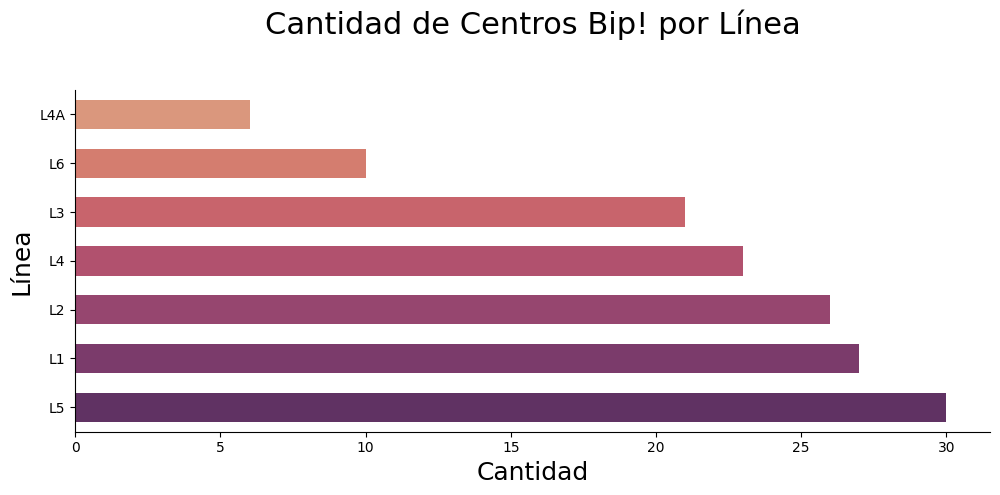

# Centros Bip! Análisis de Datos y Proceso ETL

Un simple análisis de datos de los centros bip! del sistema de transporte público de la ciudad de Santiago que integra tres modos de transporte: buses, Metro y MetroTren Nos.

Los Centros bip! son oficinas especialmente habilitadas para vender y cargar las Tarjeta bip! Actualmente, existen 57 Centros bip! donde podrás comprar y cragar tu Tarjeta bip!, validar tus cargas remotas y consultar el saldo.

Organización de carpetas:

- data: documento excel de estudio
- src: scripts de trabajo
- result: productos obtenidos

### Excel de Datos

---

### CSV de Datos Procesados

---

### Excel de Datos Por Comuna

---

### Excel de Datos Por Línea

---

### Gráficos Matplotlib - Seaborn

---

